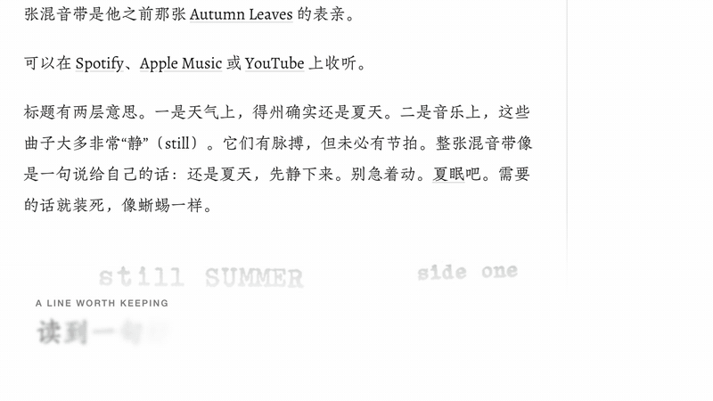
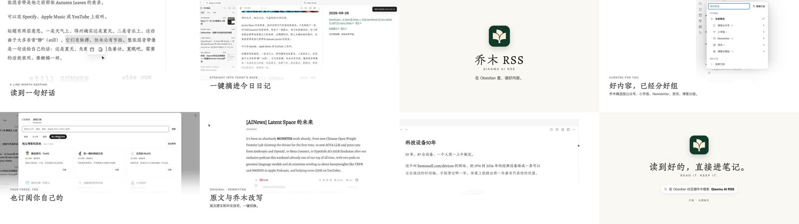
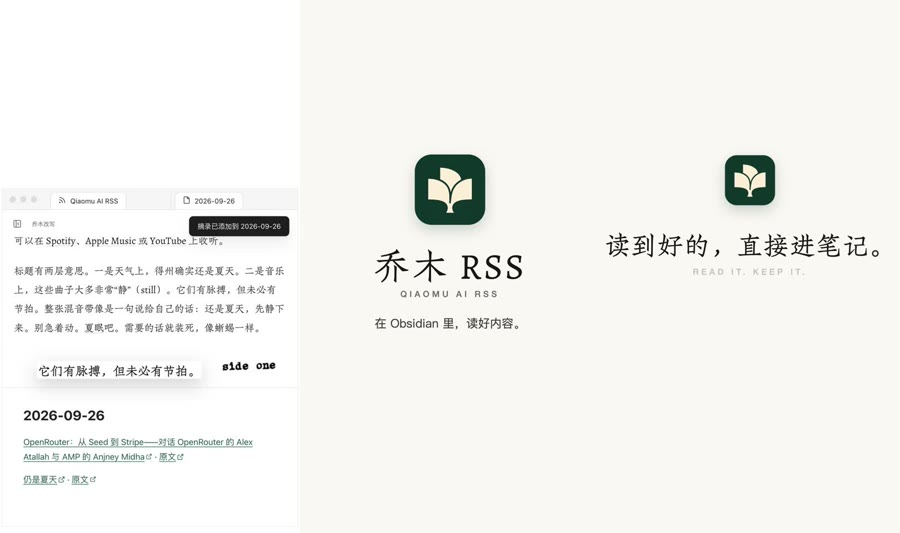
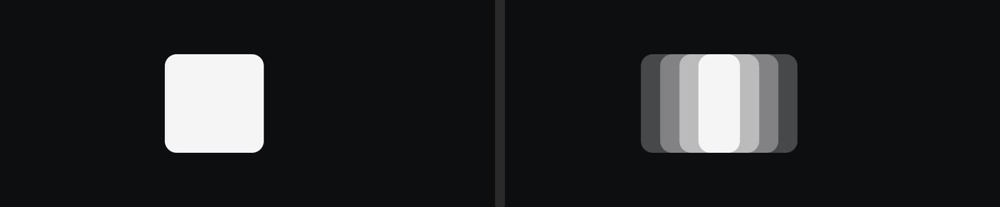
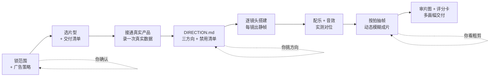
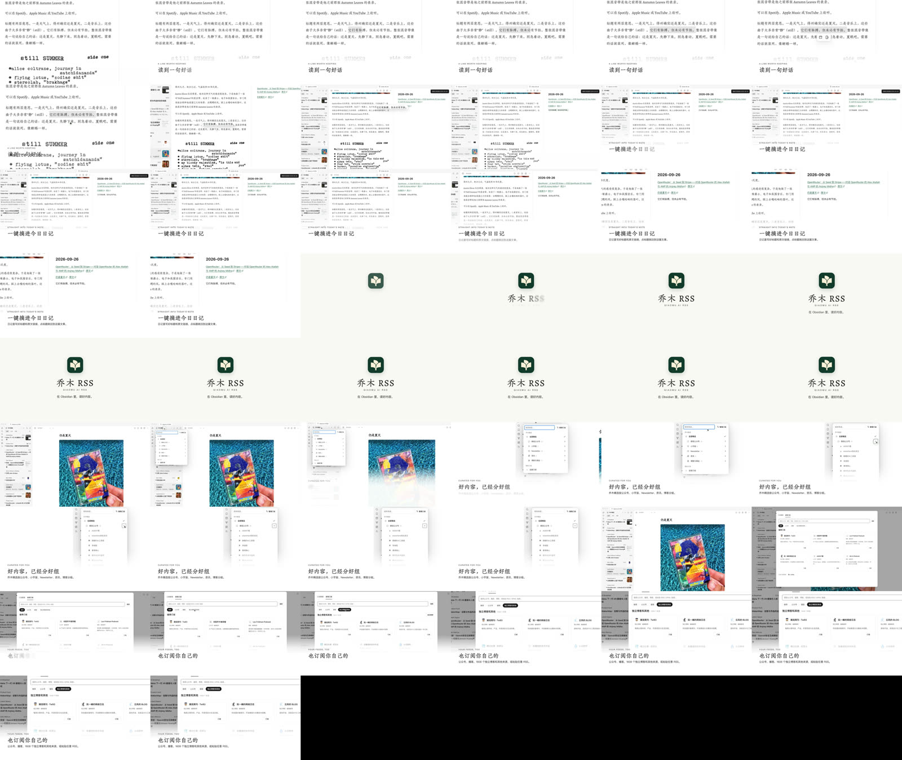
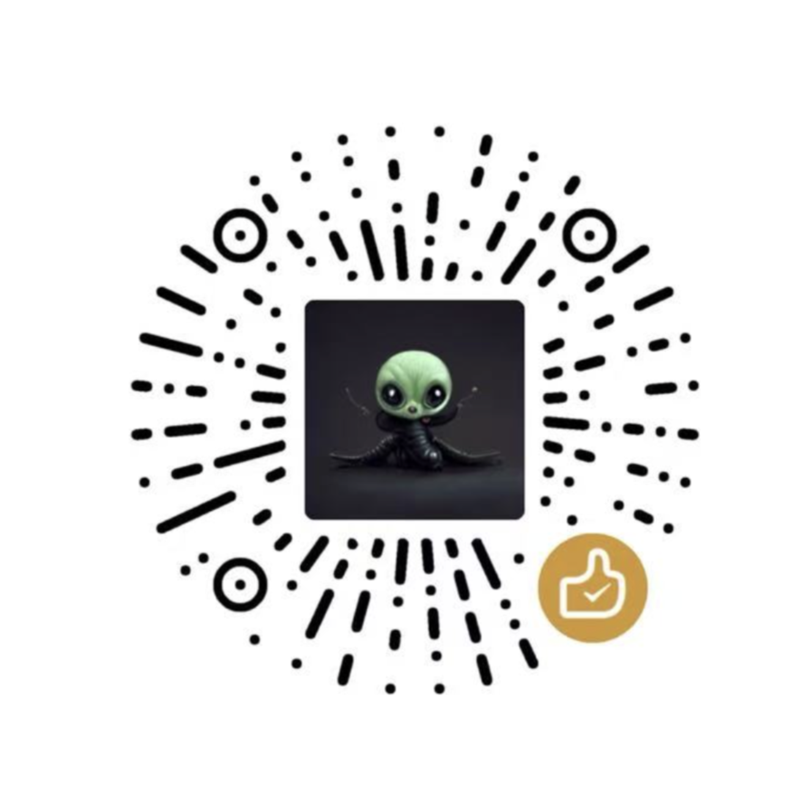

<div align="center">

# 乔木产品视频 · qiaomu-product-video

**中文** | [English](#english)


**把你的代码仓库变成一支能直接发布的产品宣传片。**<br>
先定广告策略，再把真实组件搬上镜头；配乐、音效、审片、评分卡和多画幅成片都在 skill 里。

*Turn a real repository into a launch-ready product film: strategy first, real UI on camera, original score, honest QA.*

[](manifest.json)
[](LICENSE)
[](reports/trigger-eval.json)
[](tests)
[](SKILL.md)

```bash
npx skills add joeseesun/qiaomu-product-video
```

</div>

---

## 看一眼成片

下面每一帧都来自用这个 skill 做的真实成片：给 Obsidian 插件 **Qiaomu AI RSS** 做的 50 秒主片和 32.5 秒竖版。插件的真实代码跑在镜头里，没有手画界面，也没有调用视频生成模型。

<p align="center">
  <br>
  <sub>开场 10 秒就是 aha：选中一句话 → 点一下 → 它出现在右边的今日日记里，还带着回到原文的链接。</sub>
</p>

<p align="center">
  <br>
  <sub>主片的 8 个时刻：钩子 → 一键摘录 → 品牌 → 精选分组 → 自己订阅 → 原文与改写 → 快速阅读 → CTA。</sub>
</p>

<p align="center">
  <br>
  <sub>竖版不是把横版裁一刀：产品在手机宽度下重新排版，阅读区和日记区改成上下布局。</sub>
</p>

## 为什么需要它

让 AI 做产品视频，常见的结果是：界面是手画的假 UI，每支片子长得一样，看完不知道它想说什么，配乐和画面各走各的。

这个 skill 把"做宣传片"拆成一条有检查点的流水线：

- **一支片只说一句话**。先写目标、受众、一句话主张、aha 画面和 CTA，再动手。
- **画面来自真实产品**。你的业务组件直接挂进视频工程，按视频尺度放大；数字以界面实际显示为准。
- **手法从产品推导**。写代码前先写 `DIRECTION.md`：三个方向加一个破格方向、"因为产品有 X，所以用 Y"、禁用清单、逐秒镜头表。
- **声音是完整的**。原创配乐 + 按实测起音点对齐的动作音效；你给歌的话，先测节拍再排切点。
- **交付是诚实的**。联系表、开场 3 秒条带、缩略图测试、响度报告都给你看；没看过、没听过的，交付时直说。

## 核心能力

| 能力 | 你得到什么 |
|---|---|
| 广告策略层 | 一页纸：goal / audience / singleMessage / ahaMoment / CTA，按 Google ABCD 框架检查 3 秒钩子、5 秒品牌、静音可读 |
| 7 种片型 | Linear 式无旁白、Apple 式单一主张、痛点→解决、连续运镜、创始人变更日志、小功能快切、功能单条系列，按目标选 |
| 真实产品接入 | Web/React 组件、Obsidian 等插件宿主、官网 URL、CLI 终端录制、API 真实请求、AI Agent 运行回放、移动端 |
| 自带渲染工程 | `assets/starter`：plan.json 驱动、每帧只由时间决定、Playwright 逐帧导出 MP4；可选**子帧动态模糊** |
| 原创配乐与音效 | `score.py` 按镜头结构作曲，`make_sfx.py` 合成 11 种 UI 音效，`mix_audio.py` 让位混音 + 响度 + 可闻度报告 |
| 卡点 | `beat_grid.py` 实测你给的歌的 BPM、首个强拍和 drop，报告每个切点离拍几帧 |
| 审片与评分卡 | 联系表、3 秒条带、转场条带、缩略图、循环接缝、频谱；9 项必过 + 10 维评分，建议无上下文子代理盲评 |
| 一次制作，多种成片 | 16:9 主片、9:16 竖版（重排）、15 秒剪版、官网无缝循环、单功能短片、3 种比例封面 |

## 1.3 新增：从 54 个 Opus 5.5 代码视频里学来的

2026 年 9 月，社区用 Claude Opus 5.5 做了大量"全部用代码渲染"的视频。我把 54 个案例和 18 份公开提示词整理在 [opus-video-prompts](https://github.com/joeseesun/opus-video-prompts)，挑出能复用的做法收进这个版本：

| 新增 | 做什么 |
|---|---|
| 快速通道 | 你只说一句"给这个仓库做个发布视频"，它也先给一页策略 + 逐秒分镜，再写代码 |
| 禁用清单 | DIRECTION 必写：粒子爆炸、辉光、镜头抖动、回弹缓动……模板味大多来自这些 |
| `beat_grid.py` | 用户的歌先实测节拍：切点落强拍，界面动作落拍，drop 留给 aha 或品牌镜头 |
| `kit/spring.js` | 闭式弹簧：界面状态变化有手感，任意一帧都能重算，不闪；支持两边异速的拉伸指示器 |
| `render.mjs --blur 4` | 每帧渲 4 个子帧再平均，快速运镜像摄影机拍的 |
| 按拍抽帧 + 一次改一条 | 整片渲染前抽 ≥ 20 帧修问题；你的意见一条一条改，每条出静帧确认 |
| 8 条新踩坑 | `will-change` 让放大文字发糊、3D 翻转正反面同时出现、循环接缝要连光标速度一起对上…… |

<p align="center">
  <br>
  <sub>同一帧，左边普通渲染，右边 <code>--blur 4</code>。物体每帧位移很大时 4 个子帧能看出分层，文档建议改用 8。</sub>
</p>

## 快速开始

**前置条件**

- [ ] Claude Code、Codex 或其他支持 Agent Skills 的客户端
- [ ] Python ≥ 3.9、FFmpeg / FFprobe
- [ ] Node ≥ 20，以及 Chrome（或 `npx playwright install chromium`）
- [ ] 一个能运行的产品：代码仓库、官网 URL，或至少一组真实截图

**安装**

```bash
npx skills add joeseesun/qiaomu-product-video
```

**你可以直接这样说**

- "用这个仓库给 v0.11 做一支 45 秒的更新宣传片"
- "给我的 App 最近一个月的新功能做个 changelog 视频，横版中文"
- "用这首歌给我的 App 做一支卡点宣传片"
- "给新功能做一支 15 秒的竖版产品广告，投小红书"
- "先给我三个视觉方向和几张静帧，再做产品宣传片"
- "上一支片子节奏卡、字太小，按方向文件重新改一版"

第一次它会合并问一次：宣传哪个版本范围、哪些平台面、画幅时长、能不能出现链接、有没有参考视频、沿用产品风格还是中性包装。只想快点出片，说"直接做"就行。

<details>
<summary>手动使用脚本</summary>

```bash
# 初始化视频工程（不会改动你的产品仓库）
python3 scripts/init_project.py --output films/v1 --repo ../my-app --style repo
cd films/v1 && npm install

# 录一次真实数据，之后离线确定性渲染
FILM_RECORD=1 node tools/lab.mjs --record --steps lab/flows.mjs

# 逐镜头静帧 → 成片
node tools/stills.mjs evidence/stills --shot open
node tools/render.mjs --d hero --blur 4 --final

# 声音
python3 <skill-dir>/scripts/beat_grid.py assets/song.mp3 --plan plan.json --write   # 用你的歌
python3 <skill-dir>/scripts/score.py plan.json --mood tech --key D                  # 或原创配乐
python3 <skill-dir>/scripts/make_sfx.py --out assets/sfx
python3 <skill-dir>/scripts/mix_audio.py plan.json

# 审片与结构检查
python3 <skill-dir>/scripts/review_sheets.py renders/hero.mp4 --plan plan.json --out evidence/review
python3 <skill-dir>/scripts/check_plan.py plan.json --final --tier standard
```

</details>

## 工作流



三个低成本确认点：**策略一页纸 → 三个方向的真实静帧 → 粗剪**。在最便宜的时候纠偏。

档位：`quick`（草稿、单功能短片）· `standard`（默认，正式发布）· `premium`（发布会级：三方向静帧、破格方向、盲评、评分卡硬门槛）。

## 审片不是走过场

<p align="center">
  <br>
  <sub><code>review_sheets.py</code> 生成的 2 fps 联系表（Qiaomu AI RSS 主片前半段）：一眼看出节奏、构图重复和空镜。</sub>
</p>

交付说明固定分开写：自动检查结果 / 实际看过听过的部分 / 评审方式 / 仍未验证的部分 / 实际轮数与花费。

## 产出

| 文件 | 作用 |
|---|---|
| `BRIEF.md` | 你的决定和原话 |
| `DIRECTION.md` | 方向、专属手法、画面规范、禁用清单、逐秒镜头表 |
| `plan.json` | 镜头时间、文案、主张来源、动作、音效 cue、节拍网格（唯一时间来源） |
| `evidence/` | 功能证据、风格审计、组件复用清单、音频来源、审片图、评分卡 |
| `renders/` | 主片、竖版、剪版、循环版、单条短片、封面 |

## 实测验证

| 检查 | 结果 |
|---|---|
| 触发测试 | 26/26（14 个该触发、9 个不该触发、3 个近邻）→ [`reports/trigger-eval.json`](reports/trigger-eval.json) |
| 单元测试 | 12/12：初始化、结构检查、审片、循环接缝、节拍实测（合成 128 BPM 曲：速度 ±0.6、强拍 ±25ms）、弹簧纯函数 |
| 真实成片 | Qiaomu AI RSS 主片 1500 帧 + 竖版 975 帧，0 占位帧、0 页面错误，约 −16 LUFS → [`reports/validation-qiaomu-ai-rss.md`](reports/validation-qiaomu-ai-rss.md) |
| 动态模糊 | 端到端渲染帧数、帧率不变，抽帧实看 |

维护者自检：

```bash
python3 -m unittest discover -s tests
python3 ~/.claude/skills/qiaomu-meta-skill/scripts/validate_skill.py .
python3 ~/.claude/skills/qiaomu-meta-skill/scripts/trigger_eval.py . --cases evals/trigger_cases.json --output reports/trigger-eval.json
```

## 限制与边界

- 示例成片用 1.2.0 做的；1.3.0 的节拍实测、弹簧、动态模糊还没在真实成片上用过。示例片是自评，没有盲评，声音没有用耳机实际试听。
- 脚本只检查结构：判断不了主张真不真、画面有没有被裁切、音乐好不好听。
- 不生成真人；创始人口播类片型需要你提供人物素材。Seedance、Runway 等生成式视频只能做氛围插入，不能用来伪造产品界面。
- 原生应用（SwiftUI、GPUI 等）的组件挂不进来时，需要你同意录屏或忠实重建，并在片中注明。
- 不附带字体、商用音乐或录音素材。用你自己的歌时，请确认授权。
- 渲染在本地进行：一支 50 秒 1080p 主片约 5 分钟，开 `--blur 4` 约 ×4。

## 和其他 skill 的分工

| 你有什么 | 用哪个 |
|---|---|
| 仓库 / 可运行的产品界面 | **qiaomu-product-video** |
| 只有官网 URL 或 brief | product-launch-video |
| 文章、书籍、概念做讲解视频 | qiaomu-video-composer |
| 只要脚本 | qiaomu-video-script |
| 剪辑已有素材（包括口播改动画） | qiaomu-cut |

## Troubleshooting

| 现象 | 处理 |
|---|---|
| `check_plan.py --final` 报 scope / DIRECTION 缺失 | 先确认版本范围与平台面，填完 DIRECTION.md 再搭镜头 |
| 报 `claim without source` 或 `source not found` | 在 `plan.json` 用 `repo:src/x.tsx#L40` 或 `file:docs/x.md` 写出处 |
| 报 cue 偏离动作 N 帧 | `sfx_landmarks.py` 测起音/峰值，按 `cue.at = shot.start + action.at - syncOffset` 重算 |
| `beat_grid.py` 测出的速度是一半或两倍 | 加 `--bpm-range 110-140` 限定范围，再配 click 音轨听一遍 |
| 动态模糊出现分层重影 | 物体每帧位移太大，改 `--blur 8` |
| 放大后文字发糊 | 去掉被摄像机缩放元素上的 `will-change` |
| 组件挂载报 `must be used within ...` | 缺 provider，补到挂载入口，不要手画复刻 |
| 抽帧时组件缺失或状态错 | 组件自带 CSS transition 与主时钟冲突，冻结或按时间重建 |
| 循环版首尾有跳变 | 末帧与首帧完全相同，包括光标位置和速度；`--loop` 的 SSIM ≥ 0.95 |
| 找不到 Chrome | 安装 Chrome，或设 `FILM_CHROME=/path/to/chrome`，或 `npx playwright install chromium` |

## 致谢与来源

- 广告方法：Google/YouTube [ABCDs of effective video ads](https://support.google.com/google-ads/answer/14783551)、Wistia [视频长度研究](https://wistia.com/learn/marketing/optimal-video-length)，以及公开的 SaaS 发布片分析，详见 [`reports/prior-art-research.md`](reports/prior-art-research.md)。
- 1.3 的代码视频做法：来自 [opus-video-prompts](https://github.com/joeseesun/opus-video-prompts) 整理的社区案例，每条都有原作者链接。
- 制片方法论学习自归藏的 [guizang-product-video-skill](https://github.com/op7418/guizang-product-video-skill)（AGPL-3.0）。本项目为独立重写，未复制其代码、起步工程、素材或默认样式。

<!-- qiaomu-profile:start -->
## 关于向阳乔木

向阳乔木（乔向阳 / Joe）是一位实践型 AI 产品与内容创作者，长期把前沿 AI 变化转译成可复用的工作流、产品判断、AI 编程实践、AI 搜索实践和 GEO/AI 营销方法。

- 个人网站: https://qiaomu.ai
- 博客: https://blog.qiaomu.ai
- X: https://x.com/vista8
- GitHub: https://github.com/joeseesun/
- 微信公众号: 向阳乔木推荐看

### 支持与关注

| 打赏支持 | 微信公众号 |
|---|---|
|  |  |
| 感谢支持乔木持续分享 AI 实践 | 扫码关注「向阳乔木推荐看」 |

<!-- qiaomu-profile:end -->

## License

MIT · Copyright (c) 向阳乔木 · [qiaomu.ai](https://qiaomu.ai) · [tuijian.qiaomu.ai](https://tuijian.qiaomu.ai) · [X @vista8](https://x.com/vista8) · [GitHub joeseesun](https://github.com/joeseesun/)

---

<a name="english"></a>

# English

**qiaomu-product-video** is an Agent Skill that turns a real software repository into a launch-ready product film. It works in Claude Code, Codex and other Agent Skills clients.

```bash
npx skills add joeseesun/qiaomu-product-video
```

**What it does.** You lock a one-page ad strategy first: goal, audience, a single message, the aha shot and the CTA. Then it mounts your real product components into a bundled, seek-safe render project. Every frame is a pure function of time and is exported frame by frame with Playwright. It also composes original music and synthesizes measured-sync UI sound effects, mixes to target loudness, produces review sheets and a quality scorecard, and delivers 16:9, re-laid-out 9:16, cutdowns, seamless loops and covers.

**New in 1.3** (distilled from 54 community cases of Claude Opus 5.5 code-rendered video, collected in [opus-video-prompts](https://github.com/joeseesun/opus-video-prompts)):

- a quick path that still shows a one-page storyboard first
- a mandatory banned-effects list
- `beat_grid.py`, which measures the BPM, first downbeat and drop of a supplied song
- `kit/spring.js` for closed-form springs
- `render.mjs --blur N` for subframe motion blur
- frame probing before the final render
- one-note-at-a-time iteration
- eight new pitfalls

**Try it:** "Make a 45-second release video for v0.11 of this repo using the real UI", "Make a beat-synced promo for my app with this song", or "Show me three visual directions with real stills first."

**Prerequisites:** Python ≥ 3.9, FFmpeg/FFprobe, Node ≥ 20, Chrome (or `npx playwright install chromium`), and a runnable product (repo, URL or real screenshots).

**Verified:**

- trigger eval 26/26
- unit tests 12/12
- one real film (Qiaomu AI RSS: 50 s 16:9 + 32.5 s 9:16, 0 placeholder frames, ~−16 LUFS), made with 1.2.0 and self-reviewed

**Limits:**

- The 1.3 features have not yet been used on a real film.
- The scripts check structure, not truth, cropping or taste.
- It generates no real people. Generative video may only be used for mood inserts, never for product UI.
- Native apps may need consented screen recording or faithful rebuilds.
- No fonts or commercial music are bundled.
